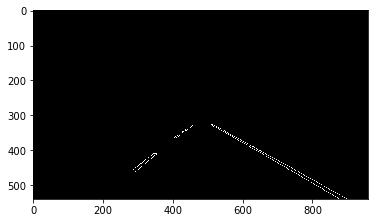
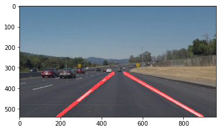

# **Finding Lane Lines on the Road** 

### The goals / steps of this project are the following:
* Make a pipeline that finds lane lines on the road
* Reflect on your work in a written report

[//]: # (Image References)

[image1]: ./examples/grayscale.jpg "Grayscale"

---

## Reflection

### 1. Description of the imagae processing pipeline. 

My pipeline consists of 5 steps. 

Step  | Image
---- | -----
Start | 
Convert image to grayscale with the build in function | 
Smoothing out noise by using Gaussian Blur algorithm | 
Canny Edge detection | 
Masking the region of interest | 
Run Hough line algorithm to find lines in the image | 

I modified the draw_lines() function to calculate the slope for all lines and the intersection with the y-axis.
All lines are classified into left and right lines and the minimum and maximum slope is saved.
Only those lines within an 80% threshold of the slope are taken into account, so that single random lines making "noise" are dropped.
The average slope and intersection with the y-axis are calculated.
Then a line has been drawn between the highest point (smallest y coordinates) and the lower edge of the image (biggest y-coordinate, y-size of the image).
The 2 lines are overlayed onto the source image.

### 2. Identify potential shortcomings with your current pipeline

* A potential shortcoming is the interference of **zebra crossings** or **tram-rails** on the line detection algorithm.
* If there is **snow** on the road the contrast would be too small to recognize the lanes and lines.
* In the challenge video there are **sharper curves** than in the first video. This means that the algorithm will detect fewer and shorter lines.

### 3. Suggest possible improvements to your pipeline

* A possible improvement would be to enhance the **contrast** of the grayscaled images. 
Lines could be better detected then, the contrast between yellow and the bright gray road seems to be too small.
* Parameter tuning could help improve the lane detection on sharp curves

