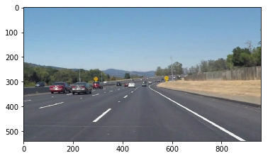
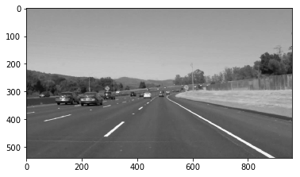
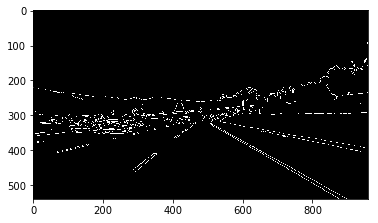
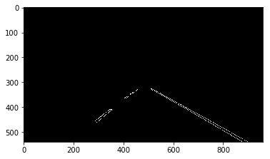
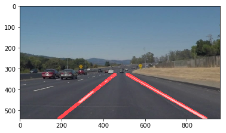

# **Finding Lane Lines on the Road** 

### The goals / steps of this project are the following:
* Make a pipeline that finds lane lines on the road
* Reflect on your work in a written report

[//]: # (Image References)

[image1]: ./examples/grayscale.jpg "Grayscale"

---

## Reflection

### 1. Description of the imagae processing pipeline. 

My pipeline consists of 5 steps. 

Step  | Image
---- | -----
Start | 
1. Convert image to grayscale with the build in function | 
2. Smoothing out noise by using Gaussian Blur algorithm | 
3. Canny Edge detection | 
4. Masking the region of interest | 
5. Run Hough line algorithm to find lines in the image | 

6. I modified the draw_lines() function to calculate the slope for all lines and the intersection with the y-axis.
All lines are classified into left and right lines and the minimum and maximum slope is saved.
Only lines that are within a threshold of 80% of the slope are taken into account, so that single random lines making "noise" are dropped.
The average slope and intersection with y-axis are calculated.
Then a line has been drawn between the highest point (smallest y coordinates) and lower edge of the image (biggest y-coordinate, y-size of the image).
The 2 lines are overlayed onto the source image.

### 2. Identify potential shortcomings with your current pipeline

One potential shortcoming would be what would happen when there is a zebra crossing or rails on street.
The line detection would not work properly. If there is snow on the road the contract would be too small to recognize the lanes and lines.
The curves in the challenge video are sharper, that makes the detected line less and shorter.

### 3. Suggest possible improvements to your pipeline

A possible improvement would be to enhance the contract of the grayscaled images. 
Lines could be better detected then, the contra
st between yellow and the bright gray road seems to be too small.
Another improvement could be to deal with sharp curves. The lanes in the previous examples where quite straight.

